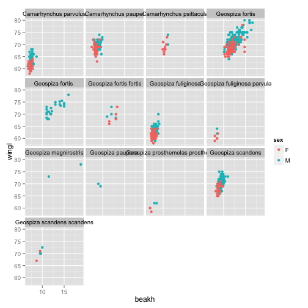
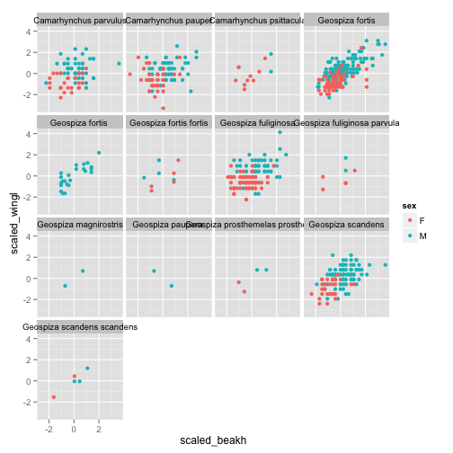

# plyr exercises

Exercises written by Sean C. Anderson, <sean@seananderson.ca>

For a Stats Beerz / Earth2Ocean workshop on December 10, 2013

*This is an R Markdown document. Install the knitr package to work with it.
See <http://www.rstudio.com/ide/docs/authoring/using_markdown> for more details.*


## Loading the data

We're going to work with morphological data from Galapagos finches, which is available from BIRDD: Beagle Investigation Return with Darwinian Data at <http://bioquest.org/birdd/morph.php>. It is originally from Sato et al. 2000 Mol. Biol. Evol. <http://mbe.oxfordjournals.org/content/18/3/299.full>.

First, load the plyr package:


```r
library(plyr)
```


I've taken the data and cleaned it up a bit for this exercise. I've removed some columns and made the column names lower case. I've also removed all but one island. You can do that with this code:


```r
morph <- read.csv("Morph_for_Sato.csv")
names(morph) <- tolower(names(morph))  # make columns names lowercase
morph <- subset(morph, islandid == "Flor_Chrl")  # take only one island
morph <- morph[, c("taxonorig", "sex", "wingl", "beakh", "ubeakl")]  # only keep these columns
morph <- rename(morph, c(taxonorig = "taxon"))  # rename() is part of plyr
morph_orig <- morph  # keep a copy with NAs for some more advanced exercises
morph <- data.frame(na.omit(morph))  # remove all rows with any NAs to make this simple
morph$taxon <- factor(morph$taxon)  # remove extra remaining factor levels
morph$sex <- factor(morph$sex)  # remove extra remaining factor levels
row.names(morph) <- NULL  # tidy up the row names
```


Take a look at the data. There are columns for taxon, sex, wing length, beak height, and upper beak length:


```r
head(morph)
str(morph)
```


## Part 1: Introduction to ddply, summarize, and transform

Let's calculate the mean wing length for each taxon:


```r
ddply(morph, "taxon", summarize, mean_wingl = mean(wingl))
```

```
##                                 taxon mean_wingl
## 1               Camarhynchus parvulus      62.96
## 2                 Camarhynchus pauper      69.15
## 3             Camarhynchus psittacula      69.58
## 4                     Geospiza fortis      70.78
## 5                    Geospiza fortis       72.30
## 6              Geospiza fortis fortis      69.39
## 7                 Geospiza fuliginosa      62.20
## 8         Geospiza fuliginosa parvula      61.14
## 9               Geospiza magnirostris      75.50
## 10                  Geospiza paupera       69.50
## 11 Geospiza prosthemelas prosthemelas      60.62
## 12                  Geospiza scandens      70.21
## 13         Geospiza scandens scandens      70.10
```


We can extend that syntax to multiple grouping columns and multiple summary columns. For example, calculate the mean and standard deviation of wing length for each taxon-sex combination:


```r
ddply(morph, c("taxon", "sex"), summarize, mean_wingl = mean(wingl), sd_wingl = sd(wingl))
```

```
##                                 taxon sex mean_wingl sd_wingl
## 1               Camarhynchus parvulus   F      61.09   1.5930
## 2               Camarhynchus parvulus   M      63.79   1.8717
## 3                 Camarhynchus pauper   F      68.21   1.8330
## 4                 Camarhynchus pauper   M      69.69   1.6763
## 5             Camarhynchus psittacula   F      68.89   2.1473
## 6             Camarhynchus psittacula   M      71.67   2.0817
## 7                     Geospiza fortis   F      68.47   2.1203
## 8                     Geospiza fortis   M      71.85   2.6861
## 9                    Geospiza fortis    M      72.30   2.6029
## 10             Geospiza fortis fortis   F      68.80   2.7749
## 11             Geospiza fortis fortis   M      70.12   2.0156
## 12                Geospiza fuliginosa   F      61.18   1.2392
## 13                Geospiza fuliginosa   M      63.19   1.8868
## 14        Geospiza fuliginosa parvula   F      60.40   1.1402
## 15        Geospiza fuliginosa parvula   M      63.00   1.4142
## 16              Geospiza magnirostris   M      75.50   3.5355
## 17                  Geospiza paupera    M      69.50   0.7071
## 18 Geospiza prosthemelas prosthemelas   F      59.25   1.0607
## 19 Geospiza prosthemelas prosthemelas   M      62.00   0.0000
## 20                  Geospiza scandens   F      68.17   1.6272
## 21                  Geospiza scandens   M      70.93   1.8792
## 22         Geospiza scandens scandens   F      69.00   2.8284
## 23         Geospiza scandens scandens   M      70.83   1.4434
```


We can, of course, do much more than just take means and variances! The `cor()` function computes the correlation between two vectors of numbers. If you're not familiar with the `cor()` function, first bring up the help file with `?cor`. Then, on your own, try calculating the correlation between wing length and beak height for each taxon.


```r
ddply(morph, "taxon", summarize, r = cor(wingl, beakh))
```

```
##                                 taxon       r
## 1               Camarhynchus parvulus  0.2775
## 2                 Camarhynchus pauper  0.2900
## 3             Camarhynchus psittacula  0.5488
## 4                     Geospiza fortis  0.6931
## 5                    Geospiza fortis   0.8110
## 6              Geospiza fortis fortis  0.3891
## 7                 Geospiza fuliginosa  0.4375
## 8         Geospiza fuliginosa parvula  0.4779
## 9               Geospiza magnirostris  1.0000
## 10                  Geospiza paupera  -1.0000
## 11 Geospiza prosthemelas prosthemelas  0.8087
## 12                  Geospiza scandens  0.5179
## 13         Geospiza scandens scandens  0.9440
```


It's always good to plot the data [to understand what's going on](http://en.wikipedia.org/wiki/Anscombe's_quartet). Although this is outside of today's scope, we can do that quickly with ggplot2 like this:


```r
library(ggplot2)
ggplot(morph, aes(beakh, wingl)) + geom_point(aes(colour = sex)) + facet_wrap(~taxon)
```

 


OK, now let's try using the `transform()` function with plyr. Whereas summarize condenses each chunk of data into a single value, `transform()` keeps the same length --- it just operates on each chunk independently. Common uses for this are to scale the data somehow (e.g. subtract the mean and divide by the standard deviation, or divide by the maximum) or run cumulative statistic functions like `cumsum()`, `cumprod()`, or `cummax()`.

Let's try scaling the wing length and beak height data within each taxon using the `scale()` function. Assign the new data frame to an object named `morph_scaled` and call the new columns `scaled_beakh` and `scaled_wingl`.


```r
morph_scaled <- ddply(morph, "taxon", transform, scaled_beakh = scale(beakh), 
    scaled_wingl = scale(wingl))
head(morph_scaled)
```

```
##                   taxon sex wingl beakh ubeakl scaled_beakh scaled_wingl
## 1 Camarhynchus parvulus   M    66   7.9   11.8       1.2750      1.39608
## 2 Camarhynchus parvulus   M    66   7.5   11.9       0.1053      1.39608
## 3 Camarhynchus parvulus   M    65   7.2   11.1      -0.7720      0.93684
## 4 Camarhynchus parvulus   M    63   7.6   12.1       0.3977      0.01837
## 5 Camarhynchus parvulus   M    62   7.3   11.6      -0.4796     -0.44087
## 6 Camarhynchus parvulus   M    64   7.6   11.9       0.3977      0.47761
```


How does this compare to the output from a `ddply()` call with `summarize()`?

Run this code to look at the output. How does this compare to the previous plot? When might you use this?


```r
library(ggplot2)
ggplot(morph_scaled, aes(scaled_beakh, scaled_wingl)) + geom_point(aes(colour = sex)) + 
    facet_wrap(~taxon)
```

 


One more thing. You can easily pass additional arguments within plyr. For example, if we used the original dataset before we removed NA values and we wanted to take the mean, we can do that by adding `na.rm = TRUE`. Remember that the data frame `morph_orig` contains the original dataset. Try taking the mean wing length for each taxon and removing NAs in one step.


```r
# the original code:
ddply(morph_orig, "taxon", summarize, mean_wingl = mean(wingl))
```

```
##                                 taxon mean_wingl
## 1                  Cactospiza pallida      70.00
## 2               Camarhynchus parvulus      62.95
## 3                 Camarhynchus pauper      69.13
## 4             Camarhynchus psittacula      69.94
## 5                           Certhidea      54.39
## 6                  Certhidea olivacea      55.00
## 7                     Geospiza fortis         NA
## 8                    Geospiza fortis       72.30
## 9              Geospiza fortis fortis      69.39
## 10                Geospiza fuliginosa         NA
## 11        Geospiza fuliginosa parvula      61.14
## 12              Geospiza magnirostris      75.50
## 13                  Geospiza paupera       69.50
## 14 Geospiza prosthemelas prosthemelas      60.62
## 15                  Geospiza scandens      70.23
## 16         Geospiza scandens scandens      70.10
## 17           Platyspiza crassirostris         NA
```

```r
ddply(morph_orig, "taxon", summarize, mean_wingl = mean(wingl, na.rm = TRUE))
```

```
##                                 taxon mean_wingl
## 1                  Cactospiza pallida      70.00
## 2               Camarhynchus parvulus      62.95
## 3                 Camarhynchus pauper      69.13
## 4             Camarhynchus psittacula      69.94
## 5                           Certhidea      54.39
## 6                  Certhidea olivacea      55.00
## 7                     Geospiza fortis      70.79
## 8                    Geospiza fortis       72.30
## 9              Geospiza fortis fortis      69.39
## 10                Geospiza fuliginosa      62.21
## 11        Geospiza fuliginosa parvula      61.14
## 12              Geospiza magnirostris      75.50
## 13                  Geospiza paupera       69.50
## 14 Geospiza prosthemelas prosthemelas      60.62
## 15                  Geospiza scandens      70.23
## 16         Geospiza scandens scandens      70.10
## 17           Platyspiza crassirostris      83.83
```


## Part 2: More advanced concepts with plyr

### Custom functions

Just to make sure everyone's on the same page, let's write a simple function that takes two numbers and adds them together. Then run it once:


```r
my_sum <- function(x, y) {
    output <- x + y
    output
}
my_sum(2, 3)
```

```
## [1] 5
```


OK, now we're going to work towards running a linear model on wing length and beak height and returning the slope and standard error in a data frame.

First, let's try returning a linear model for each taxon. We can store the output in a list and use `dlply`. We'll call the output `morph_lm`.


```r
morph_lm <- dlply(morph, "taxon", function(x) {
    lm(beakh ~ wingl, data = x)
})
```


Let's look at some of that output:

```r
morph_lm[[1]]
```

```
## 
## Call:
## lm(formula = beakh ~ wingl, data = x)
## 
## Coefficients:
## (Intercept)        wingl  
##      4.7201       0.0436
```

```r
morph_lm[[2]]
```

```
## 
## Call:
## lm(formula = beakh ~ wingl, data = x)
## 
## Coefficients:
## (Intercept)        wingl  
##      3.8566       0.0698
```


OK, now let's work through those linear models and grab the slope and standard error. Note that we're starting with a list and want to return a data frame.


```r
ldply(morph_lm, function(x) {
    slope <- summary(x)$coef[1, 2]
    se <- summary(x)$coef[2, 2]
    data.frame(slope, se)
})
```

```
##                                 taxon  slope      se
## 1               Camarhynchus parvulus  1.112 0.01766
## 2                 Camarhynchus pauper  1.586 0.02293
## 3             Camarhynchus psittacula  3.256 0.04677
## 4                     Geospiza fortis  1.348 0.01903
## 5                    Geospiza fortis   5.844 0.08078
## 6              Geospiza fortis fortis  8.356 0.12035
## 7                 Geospiza fuliginosa  1.050 0.01687
## 8         Geospiza fuliginosa parvula  3.919 0.06408
## 9               Geospiza magnirostris    NaN     NaN
## 10                  Geospiza paupera     NaN     NaN
## 11 Geospiza prosthemelas prosthemelas 10.054 0.16579
## 12                  Geospiza scandens  1.242 0.01768
## 13         Geospiza scandens scandens  3.198 0.04561
```


Note that we don't have to write our function inline. This is especially helpful for longer functions. For example, let's re-write the previous code chunk without an inline function.


```r
get_lm_stats <- function(x) {
    slope <- summary(x)$coef[1, 2]
    se <- summary(x)$coef[2, 2]
    data.frame(slope, se)
}
ldply(morph_lm, get_lm_stats)
```

```
##                                 taxon  slope      se
## 1               Camarhynchus parvulus  1.112 0.01766
## 2                 Camarhynchus pauper  1.586 0.02293
## 3             Camarhynchus psittacula  3.256 0.04677
## 4                     Geospiza fortis  1.348 0.01903
## 5                    Geospiza fortis   5.844 0.08078
## 6              Geospiza fortis fortis  8.356 0.12035
## 7                 Geospiza fuliginosa  1.050 0.01687
## 8         Geospiza fuliginosa parvula  3.919 0.06408
## 9               Geospiza magnirostris    NaN     NaN
## 10                  Geospiza paupera     NaN     NaN
## 11 Geospiza prosthemelas prosthemelas 10.054 0.16579
## 12                  Geospiza scandens  1.242 0.01768
## 13         Geospiza scandens scandens  3.198 0.04561
```


Note that we could have done all of that in one `ddply()` step. We did it in two steps to make it easier to learn from and to illustrate using lists with plyr.

Your turn: can you re-write what we just did in one call to `ddply()`?


```r
ddply(morph, "taxon", function(x) {
    m <- lm(beakh ~ wingl, data = x)
    slope <- summary(m)$coef[1, 2]
    se <- summary(m)$coef[2, 2]
    data.frame(slope, se)
})
```

```
##                                 taxon  slope      se
## 1               Camarhynchus parvulus  1.112 0.01766
## 2                 Camarhynchus pauper  1.586 0.02293
## 3             Camarhynchus psittacula  3.256 0.04677
## 4                     Geospiza fortis  1.348 0.01903
## 5                    Geospiza fortis   5.844 0.08078
## 6              Geospiza fortis fortis  8.356 0.12035
## 7                 Geospiza fuliginosa  1.050 0.01687
## 8         Geospiza fuliginosa parvula  3.919 0.06408
## 9               Geospiza magnirostris    NaN     NaN
## 10                  Geospiza paupera     NaN     NaN
## 11 Geospiza prosthemelas prosthemelas 10.054 0.16579
## 12                  Geospiza scandens  1.242 0.01768
## 13         Geospiza scandens scandens  3.198 0.04561
```


### Debugging custom functions

We're going to try debugging a custom function with `browser()`. Something is wrong with the following simple function. Let's find it:


```r
morph_ci <- ddply(morph, "taxon", function(x) {
    m <- lm(beakh ~ wingl, data = x)
    ci <- confint(m)[2, 3]
    ci
})
```

```
## Error: subscript out of bounds
```


### Vector inputs and replicates

plyr can be useful for simulations. We're going to work with a trivial example here. Let's simulate 10 values from a normal distribution with mean zero and standard deviation 1 through 4.


```r
llply(1:4, function(x) rnorm(10, 0, sd = x))
```

```
## [[1]]
##  [1]  0.2311  0.2244 -0.0474 -0.1764  0.3919  0.7401  0.8764 -1.0544
##  [9]  1.5138 -1.2850
## 
## [[2]]
##  [1]  0.35645 -0.91012  0.07421 -0.79584  0.97091 -0.06937 -1.91502
##  [8] -0.60944  0.19420 -0.62915
## 
## [[3]]
##  [1]  2.3075  3.7408 -1.4679  2.7180 -4.1915 -4.0557  1.4581 -2.2165
##  [9]  0.5429 -2.2177
## 
## [[4]]
##  [1] -3.1399 -1.2635 -1.2237  1.2727 -0.4251 -0.9166  0.5381  4.4942
##  [9]  1.1421 -1.1864
```


We can also use plyr for replication. Let's generate 10 values from a standard normal distribution (mean 0 and standard deviation 1) 20 times and each time calculate the mean. This gives us an idea how variable the mean is with a small sample size:


```r
out <- raply(20, function(x) {
    temp <- rnorm(10, 0, 1)
    mean(temp)
})
hist(out)
```

 


plyr makes parallel processing easy. Let's try the last example with and without parallel processing. We'll generate many more values (1e5) so we can see the difference and repeat the process 400 times. We'll use `laply` instead of `raply` because the replicate option does not have the parallel option built in.


```r
library(doParallel)
registerDoParallel(cores = 4)
system.time(out <- laply(1:400, function(x) {
    temp <- rnorm(1e+05, 0, 1)
    mean(temp)
}))
```

```
##    user  system elapsed 
##   4.222   0.177   4.431
```

```r
system.time(out <- laply(1:400, function(x) {
    temp <- rnorm(1e+05, 0, 1)
    mean(temp)
}, .parallel = TRUE))
```

```
##    user  system elapsed 
##   9.847   0.488   2.155
```


### Multiple arguments

plyr has an `m` option for taking in multiple inputs. This is similar to `mapply()` in base R, but of course, you get the niceties of plyr.

By multiple argument passing, I mean that you can pass multiple arguments from, say, a data frame to your function. Let's work with a simple example based off the one in `?mdply`.


```r
my_input <- data.frame(m = 1:5, sd = 1:5)
mdply(my_input, as.data.frame(rnorm), n = 2)
```

```
##    m sd    value
## 1  1  1  1.90477
## 2  1  1  1.73313
## 3  2  2  2.30604
## 4  2  2  0.49832
## 5  3  3  4.55033
## 6  3  3  6.29879
## 7  4  4 -0.06501
## 8  4  4 12.08575
## 9  5  5 -0.81454
## 10 5  5  9.75774
```


This is an example of where `expand.grid()` is often useful. For example, try using `expand.grid()` around the `my_input` data frame and re-running the same code:


```r
my_input <- expand.grid(data.frame(m = 1:5, sd = 1:5))
out <- mdply(my_input, as.data.frame(rnorm), n = 3)
head(out)
```

```
##   m sd   value
## 1 1  1  2.2535
## 2 1  1  2.3907
## 3 1  1 -0.1985
## 4 2  1  2.3581
## 5 2  1  3.5823
## 6 2  1  1.9438
```


## A very quick introduction to dplyr

The following code will only work if you have dplyr installed from source.
See <https://github.com/hadley/dplyr>

For detailed instructions on installing it on OS X see:
See <http://seananderson.ca/2013/11/18/rcpp-mavericks.html>

These bits of code are borrowed from the dplyr [introduction.Rmd](https://github.com/hadley/dplyr/blob/master/vignettes/introduction.Rmd) vignette.

First we'll unload plyr and load dplyr. The example uses a massive dataset of all flights departing Houston airports in 2011.


```r
detach(package:plyr)  # you can't (yet) have plyr loaded at the same time!
library(dplyr)
dim(hflights)
head(hflights)
```


Create a data frame of class `tble`. This is just a data frame with some smarter printing characteristics for big datasets.


```r
hflights_df <- tbl_df(hflights)
hflights_df
```


Filter is similar to `subset()`.


```r
filter(hflights_df, Month == 1, DayofMonth == 1)
```


`select()` is an easier way of selecting columns:


```r
select(hflights_df, Year, Month, DayOfWeek)
select(hflights_df, Year:DayOfWeek)
select(hflights_df, -(Year:DayOfWeek))
```


`group_by` combined with `summarise()` is the equivalent of `ddply()` and `do()` is the equivalent of `dlply()`.


```r
planes <- group_by(hflights_df, TailNum)
delay <- summarise(planes, count = n(), dist = mean(Distance, na.rm = TRUE), 
    delay = mean(ArrDelay, na.rm = TRUE))
delay <- filter(delay, count > 20, dist < 2000)

ggplot(delay, aes(dist, delay)) + geom_point(aes(size = count), alpha = 1/2) + 
    geom_smooth() + scale_size_area()
```

